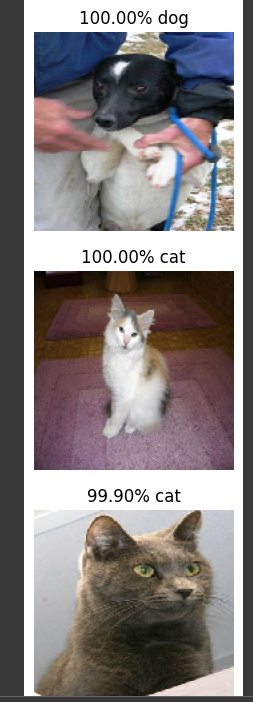

# Cat and Dog Image Classifier

## Task

[FreeCodeCamp reference](https://www.freecodecamp.org/learn/machine-learning-with-python/machine-learning-with-python-projects/cat-and-dog-image-classifier)

Create a convolutional neural network that correctly classifies images of cats and dogs at least 63% of the time

## Solution

https://colab.research.google.com/drive/1z4CZ3i-JhTekLLJbBNKXK2hy539-LtJX#scrollTo=60Xjl1czJsLt

The solution is using the MobileNetV2 convolutional neural network as a base and fits the model to the cats vs dogs traning data.

A model created from scratch using augmented images can be found in the Jupyter Notebook as well, but it performs much worse.

