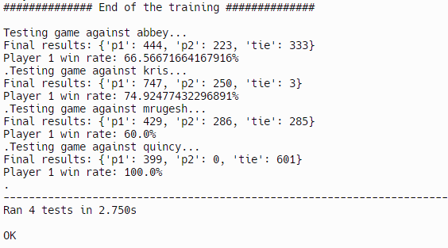

# Rock Paper Scissors
## Task
[FreeCodeCamp reference](https://www.freecodecamp.org/learn/machine-learning-with-python/machine-learning-with-python-projects/rock-paper-scissors)

Achieve win rate >= 60% against four opponents using machine learning.
## Solution
https://replit.com/@mark182182/rock-paper-scissors

The solution is using Q-learning by pre-training a model that is playing <b>10</b> matches in <b>200</b> rounds in the following order:
  - kris
  - abbey
  - quincy
  - mrugesh
  - random
  - abbey

